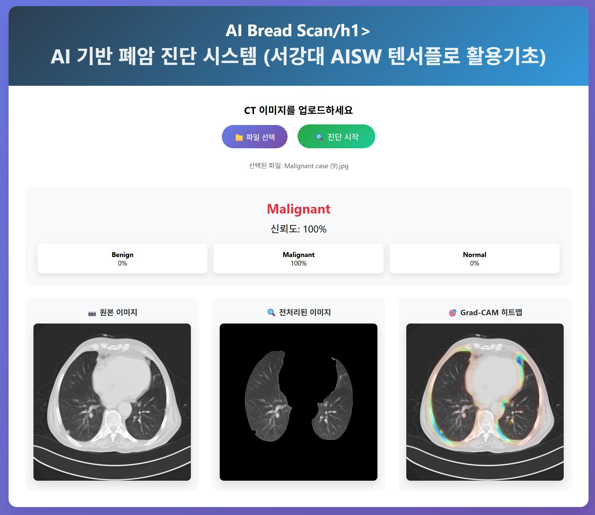
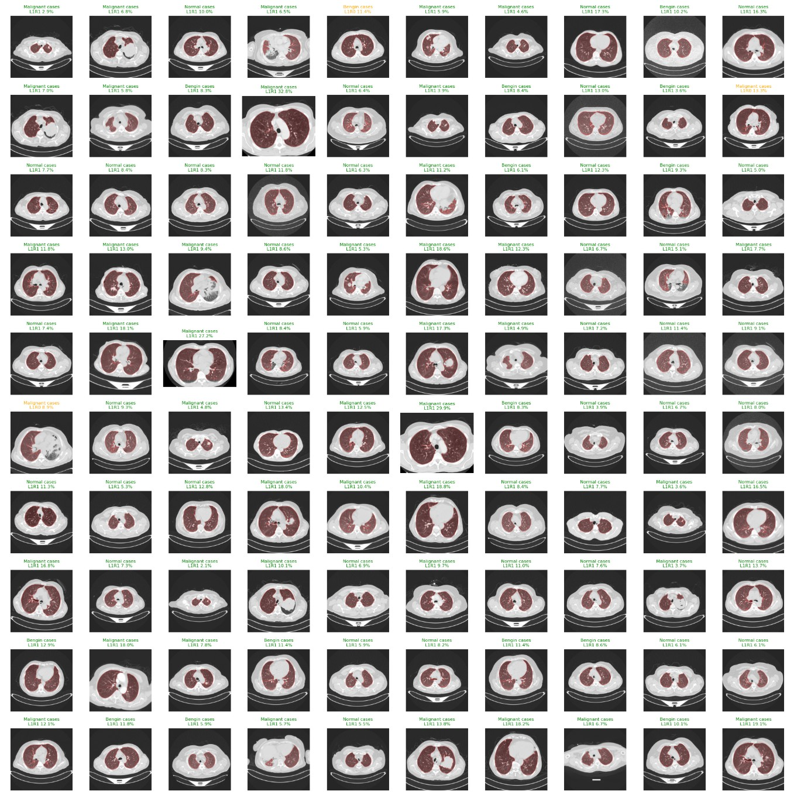

## 1. 최종
코랩 - 텐활기_기말고사_실습_250527_v2_Pre+Train 

## 2. 서버 
컴퓨터에서 jupyter로 실행
tensorflow_server_sample.ipynb

## 3. 모델 다운로드 .h5 
-v2용
https://1drv.ms/u/c/569427496c35eba0/EVn5Jsm6ZxtBpyllCoElqWEBoMRvTBCpeU6YHd-xS_zbEA?e=1RWShq

-v3용
https://1drv.ms/u/c/569427496c35eba0/ESexvZPx5ZpGuLGWfM85lsABvGfzE_iztVHzJjp-oI2aww?e=GQQYut

##이미지

